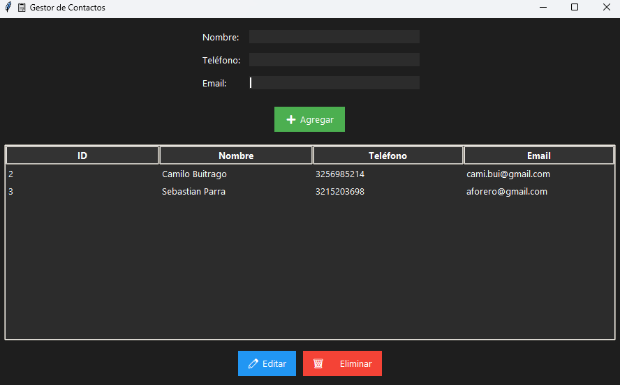
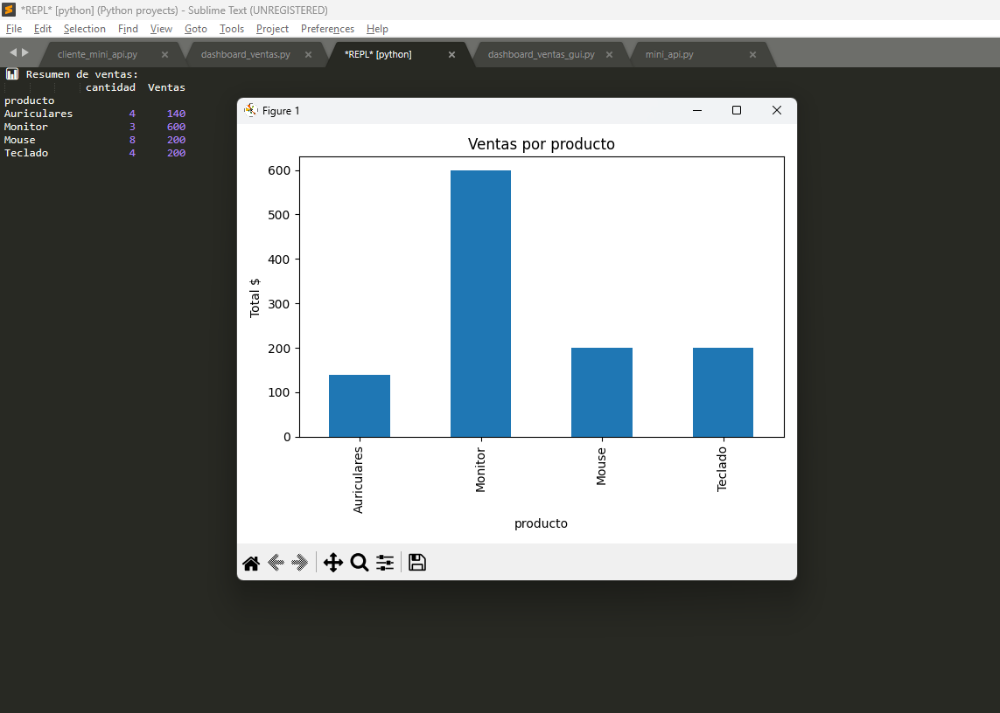
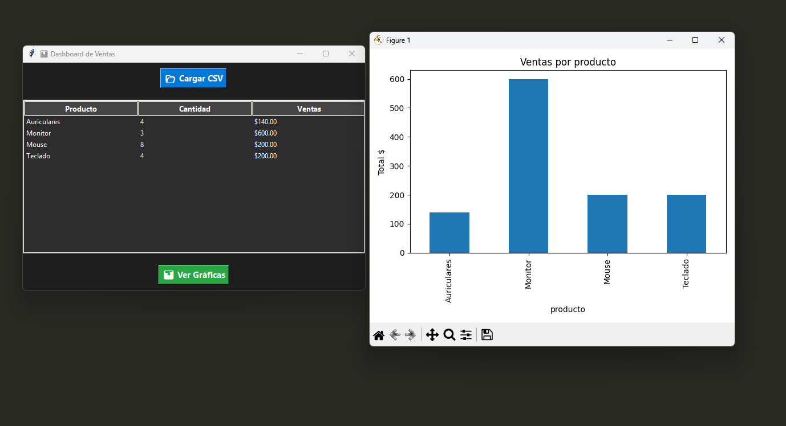
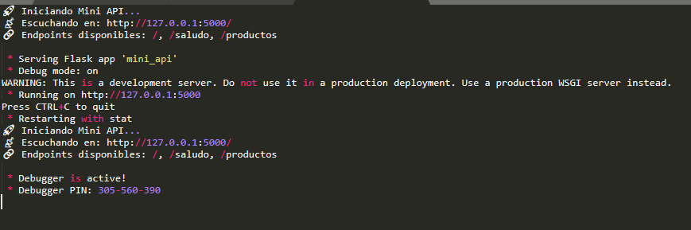
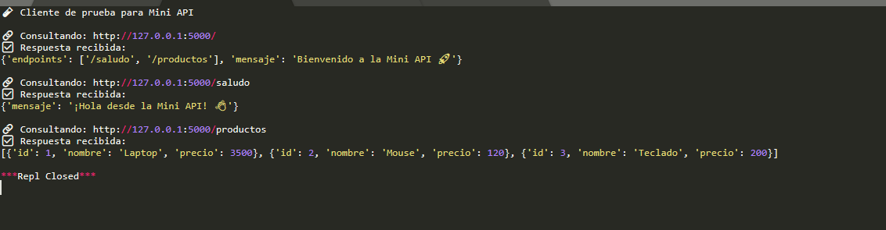

# 📂 Portafolio Nivel 3

Este repositorio contiene proyectos de Python de **nivel intermedio**, enfocados en integrar **bases de datos**, **análisis de datos**, **visualización** y **desarrollo de APIs**.  
Cada proyecto está diseñado para practicar habilidades esenciales en el desarrollo backend y análisis de datos.

---

## 🧾 Tabla de Contenidos

1. [📇 Gestor de Contactos (CRUD con SQLite)](#-1-gestor-de-contactos-crud-con-sqlite)
2. [📊 Dashboard de Ventas - Versión 1 (CLI)](#-2-dashboard-de-ventas---versión-1-cli)
3. [📊 Dashboard de Ventas - Versión 2 (GUI con Tkinter)](#-3-dashboard-de-ventas---versión-2-gui-con-tkinter)
4. [🌐 Mini API con Flask](#-4-mini-api-con-flask)
5. [📡 Cliente para la Mini API](#-5-cliente-para-la-mini-api)
6. [🚀 Instalación y Uso](#-instalación-y-uso)

---

### 📇 1. Gestor de Contactos (CRUD con SQLite)

Una aplicación con interfaz gráfica en **Tkinter** que permite:  
✅ Agregar, editar y eliminar contactos  
✅ Guardar los datos en **SQLite**  
✅ Interfaz oscura, moderna y fácil de usar  

📸 **Captura de pantalla:**  


---

### 📊 2. Dashboard de Ventas - Versión 1 (CLI)

Un script en **Python + Pandas** que:  
- Lee datos desde `ventas.csv`  
- Agrupa por categoría y muestra **gráficas de barras** con Matplotlib  
- Ideal para análisis rápido en terminal  

📸 **Captura de salida:**  


---

### 📊 3. Dashboard de Ventas - Versión 2 (GUI con Tkinter)

Versión con interfaz gráfica para mostrar métricas de ventas en tiempo real.  
✅ Gráfica de ventas por categoría  
✅ Interfaz amigable y en modo oscuro  
✅ Posibilidad de filtrar datos y actualizar  

📸 **Captura de pantalla:**  


---

### 🌐 4. Mini API con Flask

Un microservidor en **Flask** que expone datos en formato JSON.  
- Permite consultar datos de ejemplo  
- Endpoint principal: `http://127.0.0.1:5000/data`  

📸 **Captura ejecutando la API:**  


---

### 📡 5. Cliente para la Mini API

Un script que consume los datos de la API y los imprime en consola.  
✅ Ejemplo práctico de **requests**  
✅ Manejo de respuestas JSON  

📸 **Captura de salida:**  


---

## 🚀 Instalación y Uso

1. **Clonar el repositorio:**
```bash
git clone https://github.com/iparra-sys/Portafolio-Nivel-3.git
cd Portafolio-Nivel-3

2. Instalar dependencias necesarias:
```bash
pip install pandas flask matplotlib

3. Ejecutar cada proyecto según corresponda:
```bash
python crud_contactos.py
python dashboard_ventas.py
python dashboard_ventas_gui.py
python mini_api.py
python cliente_mini_api.py

